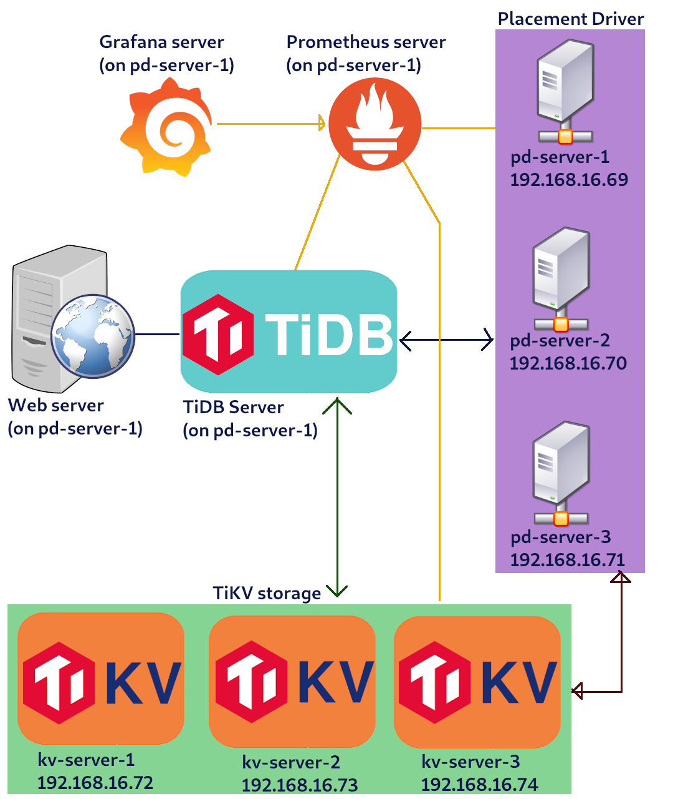
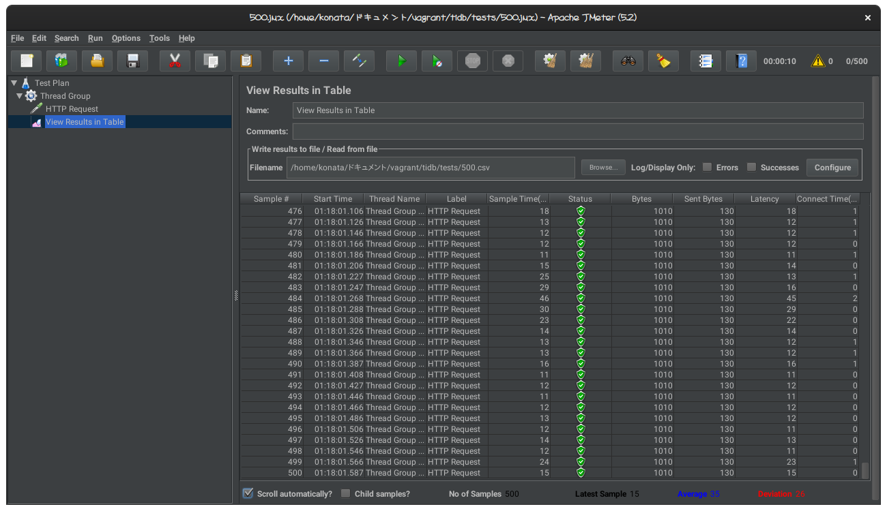
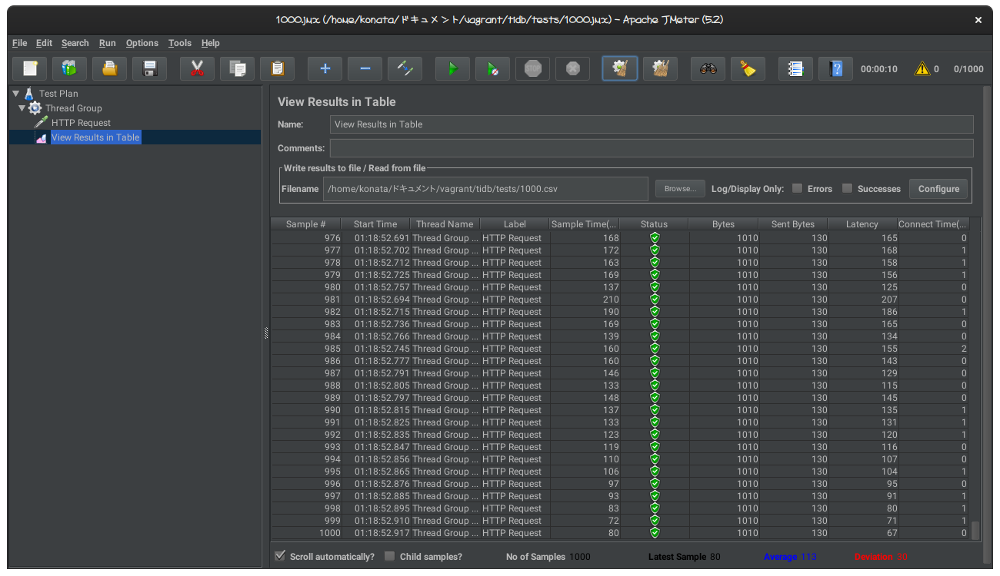
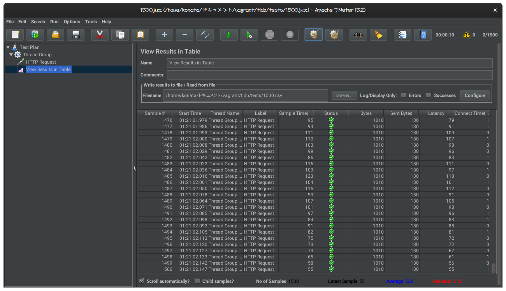
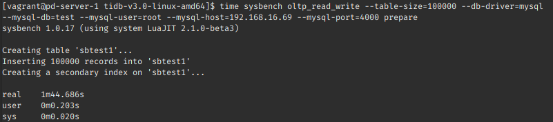
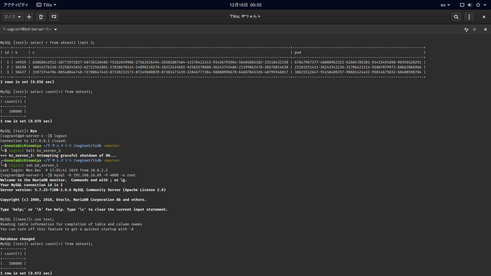
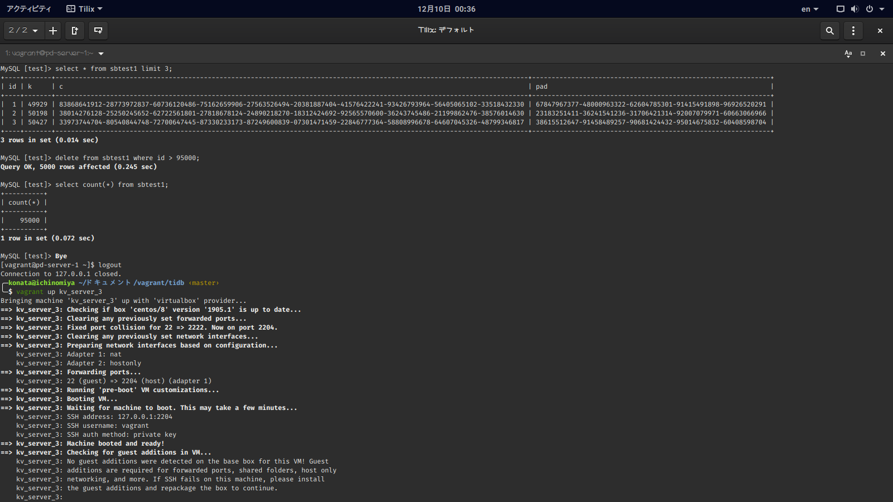
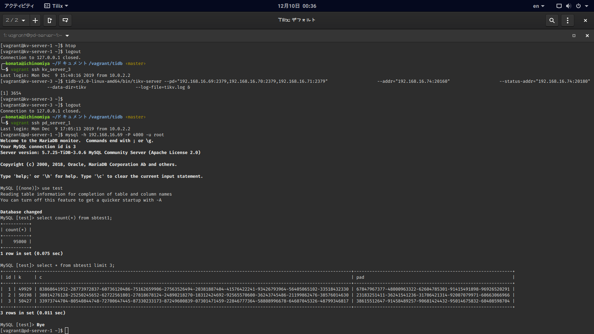

# Final-TiDB-Cluster <!-- omit in toc -->

Name: Deddy Aditya P.  
NRP: 05111640000069

## Table of Content <!-- omit in toc -->

- [System Architechture](#system-architechture)
  - [Diagram](#diagram)
  - [System Specification](#system-specification)
- [Deployment](#deployment)
- [Load Testing](#load-testing)
  - [Web Performance](#web-performance)
  - [Database Performance](#database-performance)
- [Failover Testing](#failover-testing)

## System Architechture

<!-- TODO: explain about architechtural design -->

### Diagram



### System Specification

Hostname | IP | OS | Memory | Running Services
----|----|----|----|----
pd-server-1 | 192.168.16.69 | CentOS 8 | 1024 MB | Webserver (nginx), TiDB, PD1, Prometheus, Grafana, node-exporter
pd-server-2 | 192.168.16.70 | CentOS 8 | 512 MB | PD2, node-exporter
pd-server-3 | 192.168.16.71 | CentOS 8 | 512 MB | PD3, node-exporter
kv-server-1 | 192.168.16.72 | CentOS 8 | 1024 MB | TiKV1, node-exporter
kv-server-2 | 192.168.16.73 | CentOS 8 | 1024 MB | TiKV2, node-exporter
kv-server-3 | 192.168.16.74 | CentOS 8 | 1024 MB | TiKV3, node-exporter

## Deployment

For the implementation itself, currently I'm using my past final project API linked here: https://github.com/yoshimaputri/AccountingService

Before that, I was considering to use wordpress CMS for implementation. But it acted so strange and don't want to connect to TiDB database even though I already supplied the correct database host, database name, username and password. Already checked it manually using PHP interactive shell to check if the PHP-mysql client is compatible with TiDB and the result is every connection attempts were successfully created.

This API implementation itself was written using Java with Spring Framework and Hibernate API. The application works well under TiDB cluster with some modifications from the original source code regarding the connection string. I also had to alter DDL syntax a bit from the one dumped from phpmyadmin previously because TiDB doesn't support some operation there like adding primary keys and auto_increment after table being created.

There are 12 endpoints available on this API. You can find the more complete documentation on [Swagger Page](https://app.swaggerhub.com/apis-docs/yoshimaputri/swagger-accounting/1.0.0), but I'll provide some overview here.

**Pendapatan** object:

- `tanggal`: Date (YYYY-MM-DD format)
- `jumlah`: number
- `id_restaurant`: string, optional
- `keterangan`: string, optional

**Pengeluaran** object:

- `tanggal`: Date (YYYY-MM-DD format)
- `jumlah`: number
- `id_restaurant`: string, optional
- `keterangan`: string, optional

BASE URL: http://192.168.16.69:8080/

**POST** /pendapatan  
Create new Pendapatan object.

**POST** /pengeluaran  
Create new Pengeluaran object.

**PUT** /pendapatan/{id}  
Make an edit to an existing Pendapatan object with a certain id.

**PUT** /pengeluaran/{id}  
Make an edit to an existing Pengeluaran object with a certain id.

**PATCH** /pendapatan/{id}  
Make an edit to an existing Pendapatan object with a certain id.

**PATCH** /pengeluaran/{id}  
Make an edit to an existing Pengeluaran object with a certain id.

**GET** /pendapatan  
Get the list of Pendapatan object.

**GET** /pendapatan/{tahun}  
Get the list of Pendapatan object by tahun (year).

**GET** /pendapatan/{tahun}/{bulan}  
Get the list of Pendapatan object by tahun (year) and bulan (month).

**GET** /pengeluaran  
Get the list of Pengeluaran object.

**GET** /pengeluaran/{tahun}  
Get the list of Pengeluaran object by tahun (year).

**GET** /pengeluaran/{tahun}/{bulan}  
Get the list of Pengeluaran object by tahun (year) and bulan (month).


There's no **DELETE** endpoint here because it wasn't needed on our usecase.

## Load Testing

### Web Performance

The web performance test itself just performing **GET** operation into /pendapatan endpoint. There are 3 combinations in number of connection: 500, 1000 and 1500. Pretty high number because it just serve an API without HTML elements.

Here is the test results:

**500 connections**


**1000 connections**


**1500 connections**


The result is pretty expected because it's getting slower as the the number of connection increases.

### Database Performance

I'm testing the database performance using sysbench running on pd-server-1. Here's the parameters that I use for database performance testing:

- Test Suite: oltp_read_write
- Table Size: 100000
- Running time: 300 seconds

Previously, we used 512 MB of RAM for each TiKV nodes without swap. But all TiKV processes are killed by OOM (out-of-memory) killer due to lack of RAM. Then I increased the RAM capacity for every TiKV nodes to 1GB without swap but it still got killed by OOM killer when running sysbench preparation. Then I decided to add 2GB swap space for each TiKV nodes because I can't increase RAM capacity for TiKV nodes anymore due to my limited RAM space. (I only have 8GB of RAM).



Preparation process itself took 1 minute 44 seconds in time. I guess it should be a lot faster if I added more RAM to each TiKV nodes.

Here's the sysbench testing result:

**With 3 PD servers**

```
SQL statistics:
    queries performed:
        read:                            148092
        write:                           42312
        other:                           21156
        total:                           211560
    transactions:                        10578  (35.25 per sec.)
    queries:                             211560 (705.10 per sec.)
    ignored errors:                      0      (0.00 per sec.)
    reconnects:                          0      (0.00 per sec.)

General statistics:
    total time:                          300.0047s
    total number of events:              10578

Latency (ms):
         min:                                   19.67
         avg:                                   28.36
         max:                                  308.16
         95th percentile:                       38.94
         sum:                               299955.90

Threads fairness:
    events (avg/stddev):           10578.0000/0.00
    execution time (avg/stddev):   299.9559/0.00
```

**With 2 PD servers**

```
SQL statistics:
    queries performed:
        read:                            154518
        write:                           44148
        other:                           22074
        total:                           220740
    transactions:                        11037  (36.79 per sec.)
    queries:                             220740 (735.72 per sec.)
    ignored errors:                      0      (0.00 per sec.)
    reconnects:                          0      (0.00 per sec.)

General statistics:
    total time:                          300.0325s
    total number of events:              11037

Latency (ms):
         min:                                   20.74
         avg:                                   27.18
         max:                                  510.92
         95th percentile:                       34.33
         sum:                               299984.88

Threads fairness:
    events (avg/stddev):           11037.0000/0.00
    execution time (avg/stddev):   299.9849/0.00
```

The result is pretty weird when the result of 2 PDs is slightly faster than 3 PDs. It's supposed to be slower though and I still don't understand why. 

**With 1 PD server**

No result for this section. Sysbench refused to run with only 1 pd server with reason "PD server timeout". It's able to work properly again if I started another PD server on the cluster though. Still don't know why.

## Failover Testing

I'm doing failover testing by turning off one of TiKV server and then start it again to see if the data affected in this process.

Here's the screenshot of demonstration of failover test scenario. The data still remains even if there's a dead TiKV node in the middle of transaction.




